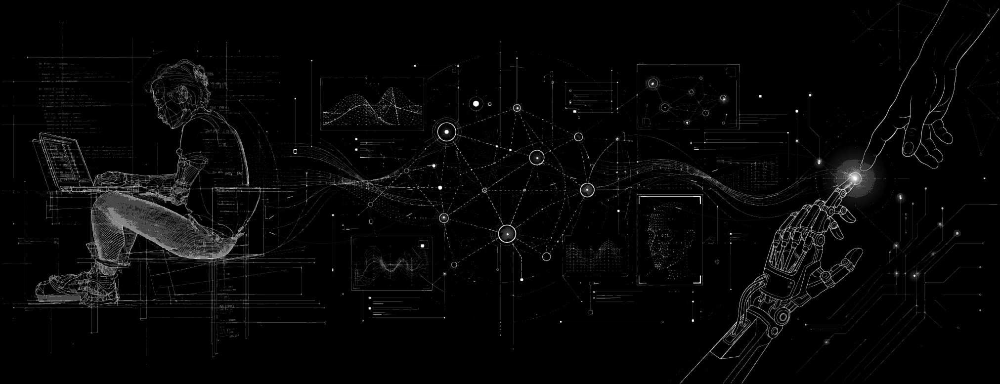
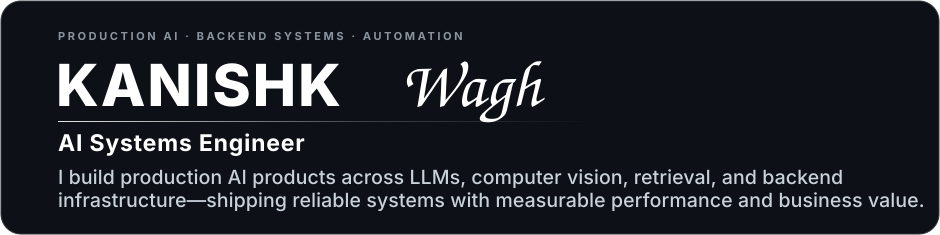
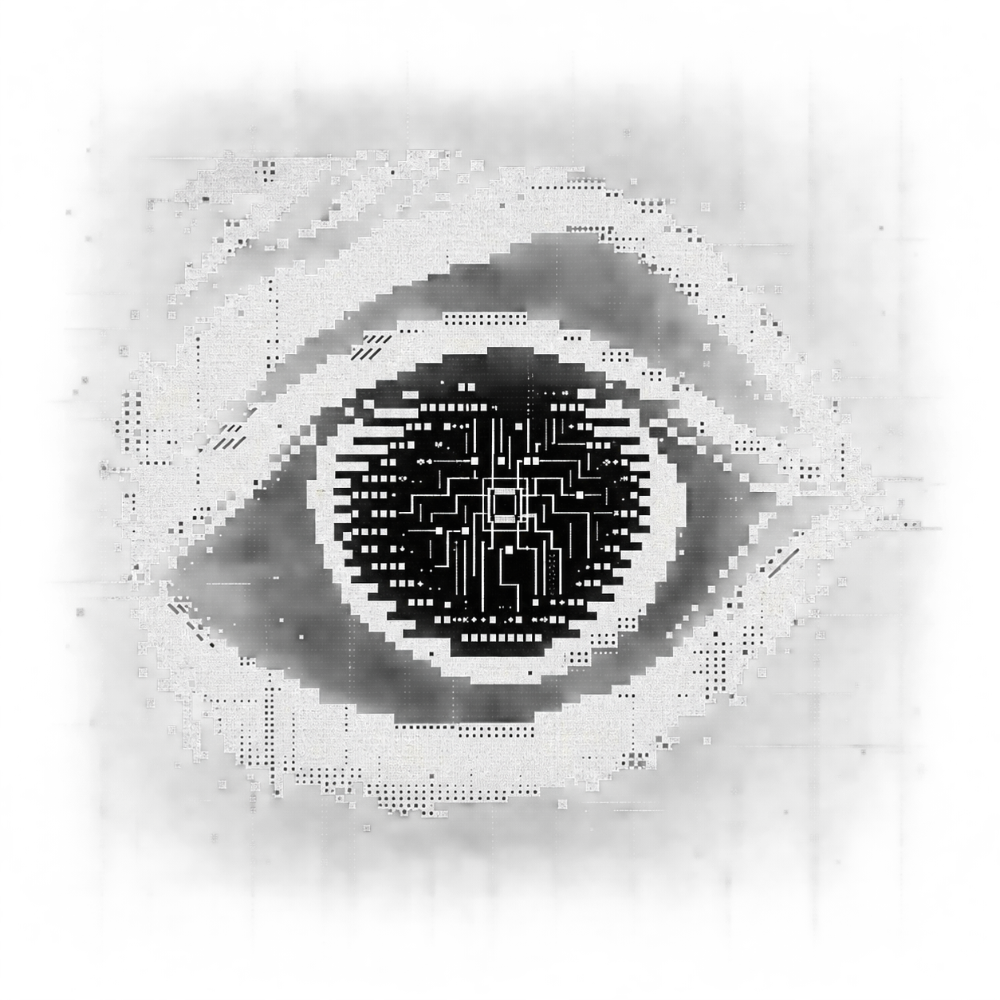

  <a href="https://kanishkwagh-portfolio.vercel.app/">Portfolio</a> ·
  <a href="https://github.com/kanishk083?tab=repositories">Repositories</a> ·
  <a href="https://www.linkedin.com/in/kanishk-wagh-937156365/">LinkedIn</a> ·
  <a href="https://x.com/kanishk9Ai">X</a> ·
  <a href="mailto:kanishkwag69@gmail.com">Email</a>

## Selected work

| Project | What it demonstrates | Links |
| --- | --- | --- |
| **Lumiqe** | AI-powered image analysis and personal styling with computer vision and LLMs. | [Repository](https://github.com/kanishk083/lumiqe) · [Portfolio](https://kanishkwagh-portfolio.vercel.app/) |
| **ATLAS** | AI knowledge and memory systems built around retrieval, reasoning, and automation. | [Repository](https://github.com/kanishk083/ATLAS) |
| **Drone Detection** | YOLO11n, FastAPI, Next.js, tracking, and measured CPU inference optimization. | [Repository](https://github.com/kanishk083/DRONE-DETECTION) |
| **Competitor Analyzer Agent** | Website change detection, SHA-256 monitoring, and LLM-generated business insights. | [Repositories](https://github.com/kanishk083?tab=repositories&q=competitor) |
| **SEO Automation Platform** | Backend automation for AI-powered SEO analysis, reporting, and background workers. | [Related repositories](https://github.com/kanishk083?tab=repositories&q=seo) |
| **Pinnacle AI** | Product and automation work focused on practical business workflows. | [Live project](https://pinnacle-ai-psi.vercel.app/) |

## Engineering toolkit

#### AI & machine learning

  
  
  
  
  
  
  
  

#### AI engineering

  
  
  
  
  

#### Data & platform

  
  
  
  
  
  
  

#### Product engineering

  
  
  
  
  
  

## Engineering activity

  
  

## What I care about

- Shipping AI systems that are measurable, observable, and maintainable.
- Designing backend foundations that can survive real users and real workloads.
- Making model performance, latency, and operating cost explicit engineering constraints.

## Currently exploring

### Robotics · UAV Systems · Autonomous Drones · Edge AI

---

<strong>Thoughtful systems. Measurable outcomes. Technology that earns trust.</strong>

  <a href="mailto:kanishkwag69@gmail.com">kanishkwag69@gmail.com</a> ·
  <a href="https://www.linkedin.com/in/kanishk-wagh-937156365/">LinkedIn</a> ·
  <a href="https://kanishkwagh-portfolio.vercel.app/">Portfolio</a>

